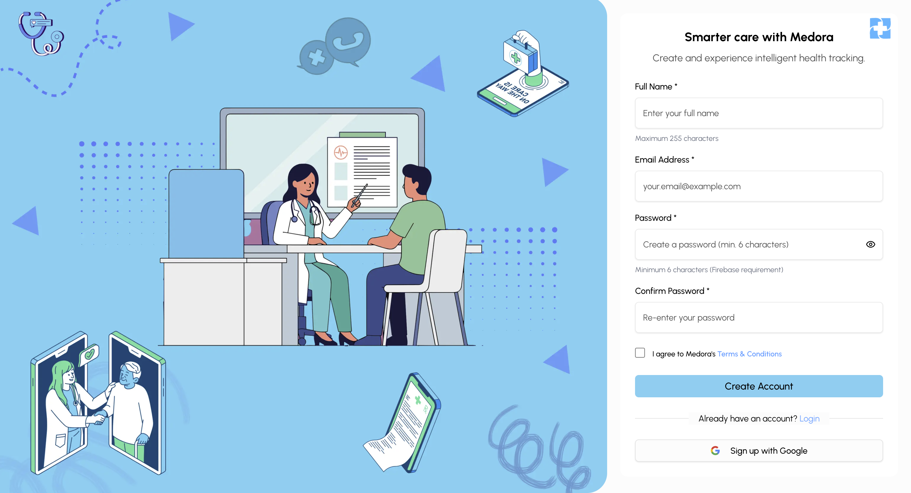
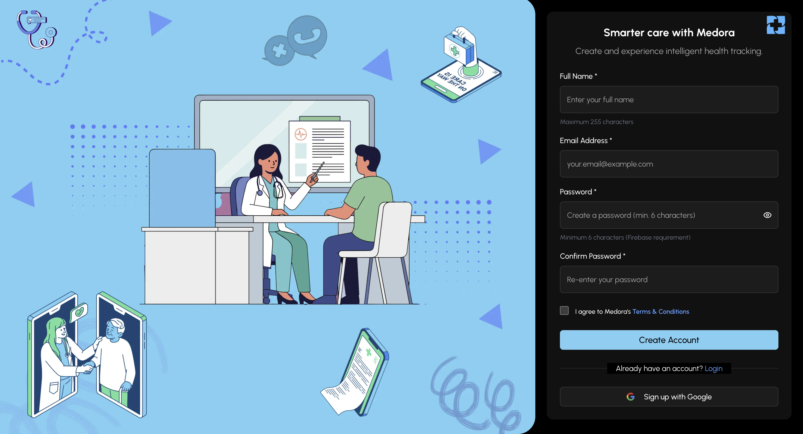
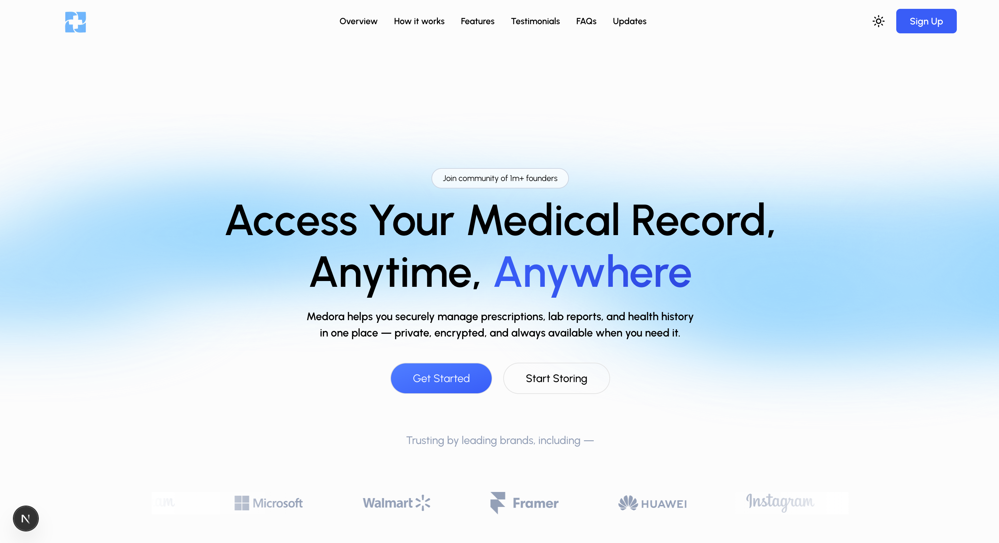
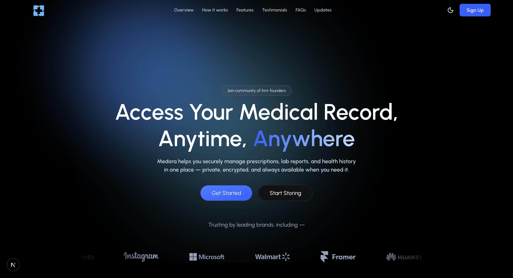
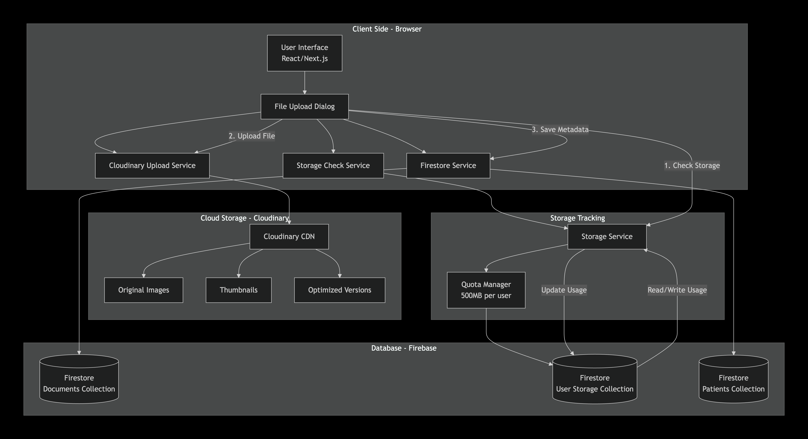
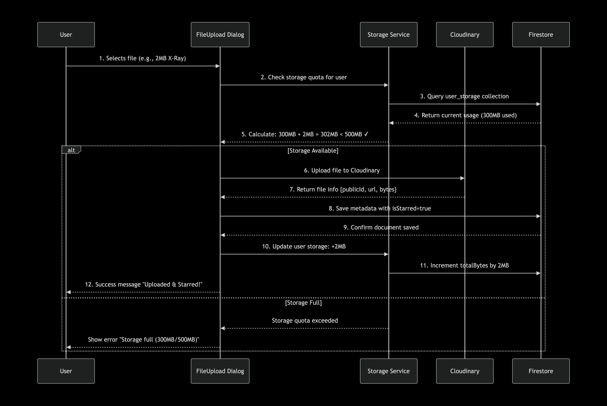

<div align="left">

# 🩺 MEDORA  
### Your Digital Health Drive 💾🛡️  
# 💌Medora Auth Pages
<div align="center">
  <table>
    <tr>
      <td align="center">
        
        <br />
        <em>🌞 Light Theme</em>
      </td>
      <td align="center">
        
        <br />
        <em>🌚 Dark Theme</em>
      </td>
    </tr>
  </table>
</div>
**Secure • Organized • User-Controlled Healthcare Data**

---

# 🏠 Home Page Preview

<div align="center">
  <table>
    <tr>
      <td align="center">
        
        <br />
        <em>🌞 Light Theme</em>
      </td>
      <td align="center">
        
        <br />
        <em>🌚 Dark Theme</em>
      </td>
    </tr>
  </table>
</div>

---

</div>

## ✨ About MEDORA


**MEDORA** is an early-stage medical technology platform designed to simplify how people store and manage their medical data.

Think of MEDORA as a **personal health drive** 📂  
where users can securely store medical records and apply for insurance—all from one platform.

---

## 🚀 Vision

Healthcare data today is scattered, hard to access, and rarely user-controlled.

MEDORA aims to:
- 🔐 **Give users full ownership** of their medical data  
- 📁 **Centralize health records** securely  
- 🛡️ **Simplify insurance access**  
- ⚡ **Make healthcare data usable and accessible**  

---
## 🏗️ System Architecture

MEDORA follows a **secure, scalable, and modular architecture** ensuring privacy-first healthcare data management.

<div align="left">
  
  <br />
  <em>High-level system architecture of MEDORA</em>
</div>

### 🔁 Architecture Overview
- 🖥️ **Client (Next.js App)** handles UI and user interactions  
- 🔐 **Firebase Auth** manages secure authentication  
- 📦 **Firestore** stores user metadata and document references  
- ☁️ **Cloudinary** securely stores medical files  
- ▲ **Vercel** enables fast global deployment  

---

## 📤 File Upload Process

The upload flow is designed to ensure **security, validation, and real-time availability**.

<div align="left">
  
  <br />
  <em>Medical document upload workflow</em>
</div>

### 🔄 Upload Flow
1. 👤 User selects a medical document  
2. 🧪 Client-side validation (type & size)  
3. ☁️ Secure upload to Cloudinary  
4. 🆔 Metadata stored in Firestore  
5. 🔄 Real-time sync to dashboard  

---
## 💡 Key Features


### 📂 Medical Data Storage
Upload reports, prescriptions, and medical history like a cloud drive.

### 🔐 Privacy-First Architecture
User-controlled access and secure handling of sensitive data.

### 🛡️ Insurance Integration
Apply for medical insurance directly from MEDORA.

### 🧾 Clean Record Organization
Structured and searchable health records.

### 🌓 Dark / Light Mode
Seamless theme switching with persistent user preference.

### 📱 Responsive Design
Optimized for desktop, tablet, and mobile devices.

### 🔄 Real-time Updates
Instant synchronization across all devices.

---

## 🛠️ Tech Stack

<div align="center">

| Category | Technologies |
|--------|-------------|
| **Frontend** | Next.js 15 (App Router), TypeScript, React 19 |
| **Styling** | Tailwind CSS, shadcn/ui, Framer Motion, Lucide Icons |
| **Authentication** | Firebase Auth (Email, OTP, Google OAuth) |
| **Database** | Firestore (NoSQL, real-time sync) |
| **Storage** | Cloudinary (Images & PDFs) |
| **State** | React Context, Custom Hooks |
| **Deployment** | Vercel, Edge Functions |
| **Analytics** | Google Analytics, Error Tracking |

</div>


## 🔐 Environment Variables

```env
# Firebase
NEXT_PUBLIC_FIREBASE_API_KEY=your_api_key
NEXT_PUBLIC_FIREBASE_AUTH_DOMAIN=your_auth_domain
NEXT_PUBLIC_FIREBASE_PROJECT_ID=your_project_id
NEXT_PUBLIC_FIREBASE_STORAGE_BUCKET=your_storage_bucket
NEXT_PUBLIC_FIREBASE_MESSAGING_SENDER_ID=your_sender_id
NEXT_PUBLIC_FIREBASE_APP_ID=your_app_id

# Cloudinary
NEXT_PUBLIC_CLOUDINARY_CLOUD_NAME=your_cloud_name
NEXT_PUBLIC_CLOUDINARY_UPLOAD_PRESET=your_upload_preset

# App URL
NEXT_PUBLIC_APP_URL=http://localhost:3000
